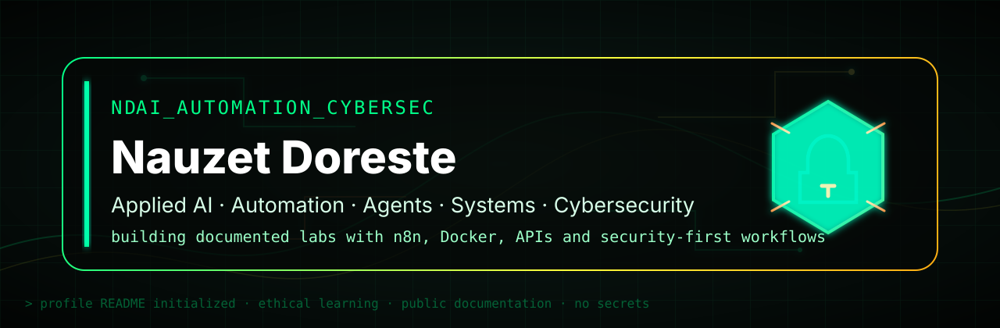

<!--
  README profile for github.com/ndoreste
  Theme: dark "cyber" look with cyan/green accents (#00fff2 / #00ff88 on #0d1117)
-->

<div align="center">

<!-- Banner (keep your existing asset) -->


# Hi, I'm Nauzet Doreste

### Applied AI · Automation · Agents · Systems · Cybersecurity

<p>
  <a href="https://github.com/ndoreste?tab=repositories"></a>
  
  
</p>


<!-- Language proficiency -->
<p>
  
  
</p>

</div>

---

## About me

I'm a **2nd-year ASIR student** currently also taking a **Master's in Cybersecurity** at **ThePower Prometeo**. My goal is to build a solid technical foundation in systems, networking, Linux, automation and security — and then move into a **specialization in Artificial Intelligence**.

On my own I'm going deeper into **automation with n8n**, **API integrations**, and the practical use of **agentic AI**: agents connected to tools, automated workflows, and documented systems with a security-first mindset.

My public projects reflect that path: automation labs, agent ecosystems, hands-on practice with Python, SQL and JavaScript, and documentation focused on *learning by building real projects*.

```yaml
current_profile:
  education:     2nd-year ASIR + Master's in Cybersecurity · ThePower Prometeo
  next_step:     specialization in Artificial Intelligence
  focus:         systems + cybersecurity + automation + agentic AI
  hands_on:      n8n, APIs, Docker, Linux, Python, technical documentation
  principle:     publish without secrets — with technical context, security-first
```

---

## Current focus

- Applied **AI** for real processes and technical productivity.
- Workflow **automation with n8n**.
- **Agent ecosystems** and assistants connected to tools.
- **Docker**, APIs, integrations and basic VPS deployments.
- **Systems administration**, Linux and IT support (in training).
- **Defensive cybersecurity**, labs and technical documentation.

---

## Stack & tools

<div align="center">


<p>
  
  
  
  
  
</p>

</div>

---

## GitHub in numbers

<div align="center">


<br/>


<br/>


<br/>


</div>

---

## Featured projects

### AI Agent Ecosystem
Documentation of a multi-agent ecosystem with Docker, messaging gateways, APIs, LLM providers and a security-first approach.

- AI agent architecture and orchestration.
- Telegram and Discord integrations.
- Docker patterns and `env.example`.
- Anonymized case studies.

**[View repository →](https://github.com/ndoreste/ai-agent-ecosystem)**

### n8n Automation Lab
Public lab of n8n automations with anonymized workflows, API patterns and secure documentation.

- Documented n8n workflows.
- Content, alerts and process automation.
- Clear separation between public examples and real credentials.
- Publishing best practices.

**[View repository →](https://github.com/ndoreste/n8n-automation-lab)**

---

## Labs & secondary repos

| Project | Area | What it demonstrates |
| --- | --- | --- |
| [Interactive Test Platform](https://github.com/ndoreste/interactive-test-platform) | ASIR / JavaScript | Interactive platform to practice tests and reinforce UI logic. |
| [Python Katas Practice](https://github.com/ndoreste/python-katas-practice) | Python | Scripting fundamentals, logic and automation. |
| [SQL Practice Project](https://github.com/ndoreste/sql-practice-project) | Databases | Relational queries, data filtering and SQL fundamentals. |
| [JavaScript Katas Practice](https://github.com/ndoreste/javascript-katas-practice) | JavaScript | Problem-solving and progressive language practice. |
| [Personal Portfolio HTML/CSS](https://github.com/ndoreste/personal-portfolio-html-css) | Frontend basics | Learning progression and visual fundamentals. |

---

## Current education

| Program | Center | Status |
| --- | --- | --- |
| 2nd-year ASIR | ThePower Prometeo | In progress |
| Master's in Cybersecurity | ThePower Prometeo | In progress |
| Specialization in Artificial Intelligence | Next step | Planned after the current stage |

---

## Areas I'm developing

| Area | What I'm practicing |
| --- | --- |
| Applied AI | agents, LLM workflows and API integrations |
| Automation | n8n, Docker, APIs and documented processes |
| Systems | Linux, IT support, VPS and administration fundamentals |
| Cybersecurity | labs, hardening and secure documentation |

---

## Let's connect

<div align="center">

<a href="mailto:ndorestegarcia.thepower@gmail.com"></a>
<a href="https://github.com/ndoreste?tab=repositories"></a>
<a href="https://github.com/ndoreste"></a>

</div>

---

<div align="center">

**Building real projects to learn, document and move forward in tech.**

<sub>Canary Islands, Spain</sub>

</div>
<h1 align="center">Hola, soy Nauzet Doreste</h1>

<p align="center">
  
</p>

<p align="center">
  <strong>IA aplicada · Automatización · Agentes · Sistemas · Ciberseguridad</strong>
</p>

<p align="center">
  <a href="https://github.com/ndoreste?tab=repositories">
    
  </a>
  
  
</p>

---

## Sobre mí

Soy estudiante de **2º de ASIR** y actualmente curso también un **Máster en Ciberseguridad** en **ThePower Prometeo**. Mi objetivo es consolidar una base técnica sólida en sistemas, redes, Linux, automatización y seguridad, y continuar después con una **especialización en Inteligencia Artificial**.

De forma autodidacta estoy profundizando en **automatizaciones con n8n**, integraciones mediante APIs y aplicación práctica de **IA agéntica**: agentes conectados a herramientas, flujos de trabajo automatizados y sistemas documentados con enfoque seguro.

Mis proyectos públicos reflejan ese camino: laboratorios de automatización, ecosistemas de agentes, prácticas de Python, SQL y JavaScript, y documentación orientada a aprender construyendo proyectos reales.

```txt
> perfil_actual
  formación: 2º ASIR + Máster en Ciberseguridad · ThePower Prometeo
  siguiente_paso: especialización en Inteligencia Artificial
  foco: sistemas + ciberseguridad + automatización + IA agéntica
  práctica: n8n, APIs, Docker, Linux, Python y documentación técnica
  principio: publicar sin secretos, con contexto técnico y enfoque security-first
```

---

## Enfoque actual

- IA aplicada a procesos reales y productividad técnica.
- Automatización de workflows con **n8n**.
- Ecosistemas de agentes y asistentes conectados a herramientas.
- Docker, APIs, integraciones y despliegues básicos en VPS.
- Administración de sistemas, Linux y soporte IT en formación.
- Ciberseguridad defensiva, laboratorios y documentación técnica.

---

## Stack y herramientas

<p align="center">
  
</p>

<p align="center">
  
  
  
  
  
</p>

---

## Proyectos principales

<table>
  <tr>
    <td width="50%" valign="top">
      <h3>AI Agent Ecosystem</h3>
      <p>Documentación de un ecosistema multiagente con Docker, gateways de mensajería, APIs, proveedores LLM y enfoque security-first.</p>
      <ul>
        <li>Arquitectura de agentes de IA.</li>
        <li>Integraciones con Telegram y Discord.</li>
        <li>Patrones Docker y <code>env.example</code>.</li>
        <li>Casos de estudio anonimizados.</li>
      </ul>
      <p><a href="https://github.com/ndoreste/ai-agent-ecosystem">Ver repositorio →</a></p>
    </td>
    <td width="50%" valign="top">
      <h3>n8n Automation Lab</h3>
      <p>Laboratorio público de automatizaciones n8n con workflows anonimizados, patrones API y documentación segura.</p>
      <ul>
        <li>Workflows n8n documentados.</li>
        <li>Automatización de contenido, alertas y procesos.</li>
        <li>Separación entre ejemplos públicos y credenciales reales.</li>
        <li>Buenas prácticas de publicación.</li>
      </ul>
      <p><a href="https://github.com/ndoreste/n8n-automation-lab">Ver repositorio →</a></p>
    </td>
  </tr>
</table>

---

## Laboratorios y repos secundarios

| Proyecto | Área | Qué demuestra |
|---|---|---|
| [Interactive Test Platform](https://github.com/ndoreste/interactive-test-platform) | ASIR / JavaScript | Plataforma interactiva para practicar tests y reforzar lógica de interfaz. |
| [Python Katas Practice](https://github.com/ndoreste/python-katas-practice) | Python | Fundamentos de scripting, lógica y automatización. |
| [SQL Practice Project](https://github.com/ndoreste/sql-practice-project) | Bases de datos | Consultas relacionales, filtrado de datos y fundamentos SQL. |
| [JavaScript Katas Practice](https://github.com/ndoreste/javascript-katas-practice) | JavaScript | Resolución de problemas y práctica progresiva del lenguaje. |
| [Personal Portfolio HTML/CSS](https://github.com/ndoreste/personal-portfolio-html-css) | Frontend inicial | Evolución de aprendizaje y fundamentos visuales. |

---

## Formación actual

| Formación | Centro | Estado |
|---|---|---|
| 2º de ASIR | ThePower Prometeo | En curso |
| Máster en Ciberseguridad | ThePower Prometeo | En curso |
| Especialización en Inteligencia Artificial | Próximo paso formativo | Planificada tras finalizar la etapa actual |

---

## Áreas que estoy desarrollando

| Área | Estoy practicando |
|---|---|
| IA aplicada | agentes, workflows con LLMs e integraciones API |
| Automatización | n8n, Docker, APIs y procesos documentados |
| Sistemas | Linux, soporte IT, VPS y fundamentos de administración |
| Ciberseguridad | laboratorios, hardening y documentación segura |

---

<p align="center">
  <strong>Construyendo proyectos reales para aprender, documentar y avanzar hacia tecnología.</strong>
</p>

